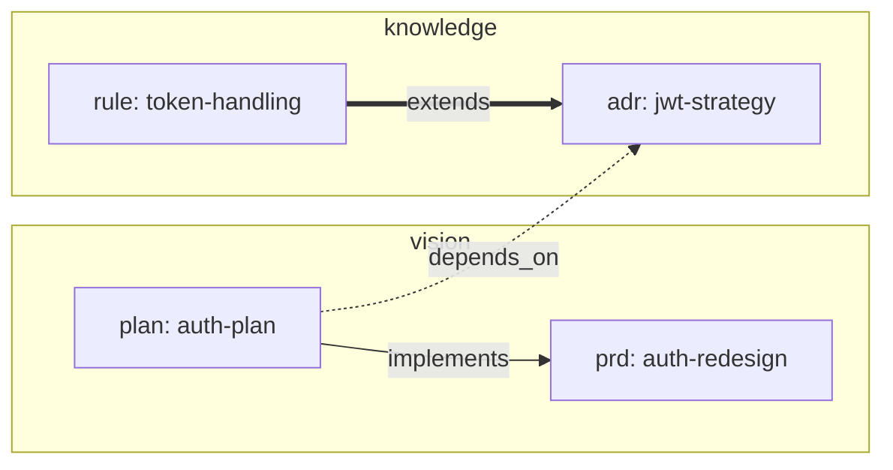

# /archcore:graph

Visualize the Archcore knowledge base as a Mermaid flowchart with grouped nodes, styled edges per relation type, and a separate orphan list.

## When to use

- "Show me the document graph"
- "Render the relation map"
- "Visualize the knowledge base"
- "Draw the docs graph for [tag/type/doc]"

**Not graph:**

- Narrative health audit with recommendations → `/archcore:review`
- Compact counts dashboard → `/archcore:status`
- Staleness/drift detection → `/archcore:actualize`

## Routing table

| Signal                                | Scope                                | Filter                                                                         |
| ------------------------------------- | ------------------------------------ | ------------------------------------------------------------------------------ |
| No arguments                          | full graph                           | all documents, all relations                                                   |
| Tag name (`auth`, `payments`)         | tag-scoped subgraph                  | documents having the tag + their relations                                     |
| Type identifier (`adr`, `prd`, ...)   | type-scoped subgraph                 | documents of that type + their relations                                       |
| Category (`vision`, `knowledge`, `experience`) | category-scoped subgraph     | documents in that category                                                     |
| Document slug (matches an existing path) | 1-hop neighborhood              | the document + everything it relates to or is related from                     |
| Ambiguous                             | ask one scope question               | "Graph the full set, or filter by tag/type/category/slug?"                     |

Default: full graph.

## Execution

### Step 1: Gather

Call in parallel:

- `mcp__archcore__list_documents` (apply type/category filter from `$ARGUMENTS` when possible)
- `mcp__archcore__list_relations`

If the filter is a tag or slug, fetch the full document list first, then filter in-memory.

### Step 2: Build the Mermaid diagram

Compose a `flowchart LR` Mermaid block:

1. **Subgraphs per category** — one `subgraph vision`, one `subgraph knowledge`, one `subgraph experience`. Skip empty categories.
2. **Node label** — `<type>: <slug>` (e.g., `adr: jwt-strategy`). Keep labels short — the full title can be added as Mermaid `click` annotation if useful.
3. **Edge styles by relation type**:
   - `implements`  → `-->` (solid arrow)
   - `depends_on`  → `-.->` (dashed arrow)
   - `extends`     → `==>` (thick arrow)
   - `related`     → `---` (plain line, no direction semantics)
4. **Node IDs** — use `<type>_<slug>` with non-alphanumeric characters replaced by `_`. This must be a valid Mermaid id.
5. **Quoting** — wrap labels with spaces or colons in double quotes: `adr_jwt["adr: JWT Strategy"]`.

Example output frame:



### Step 3: List orphans

Below the diagram, list documents that have zero outgoing and zero incoming relations in the filtered set:

```
## Orphans (no relations)
- knowledge: component-registry — `.archcore/plugin/component-registry.doc.md`
- vision: release-notes — `.archcore/release-notes.plan.md`
```

If there are none, state: "No orphans in this view."

### Step 4: Summary stats

Add a compact footer:

```
## Summary
- Nodes: N (vision M, knowledge K, experience L)
- Edges: implements=A, depends_on=B, extends=C, related=D
- Largest component: P nodes
- Orphans: Q
```

If filtered, prefix with the filter: "Filtered to tag=`auth` — ...".

### Step 5: Offer next actions

After the output, suggest:

- `/archcore:review` to audit orphans and missing relations
- `/archcore:actualize [slug]` to check code-doc drift for a specific document
- Re-invoke `/archcore:graph <slug>` to focus on a neighborhood

## Result

A Mermaid flowchart block (rendered in supporting UIs as an interactive diagram, shown as code otherwise), an orphan list, and summary stats. Read-only — no documents are created or modified.
